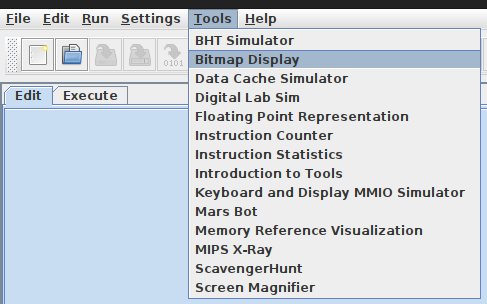
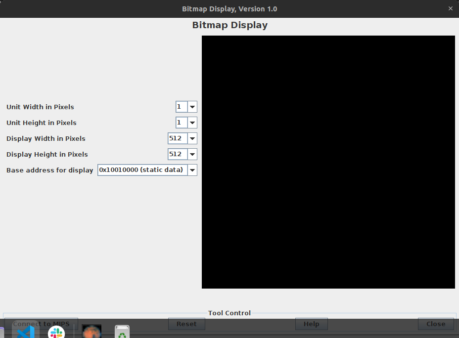
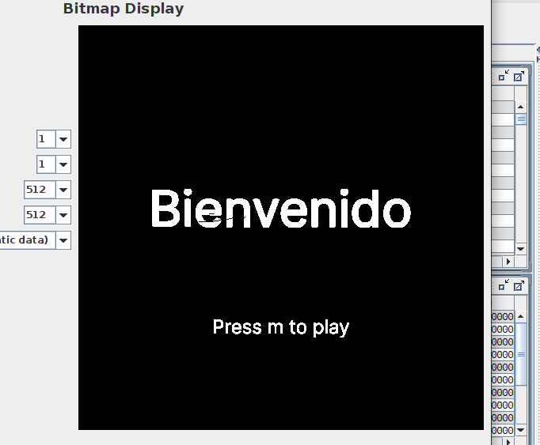
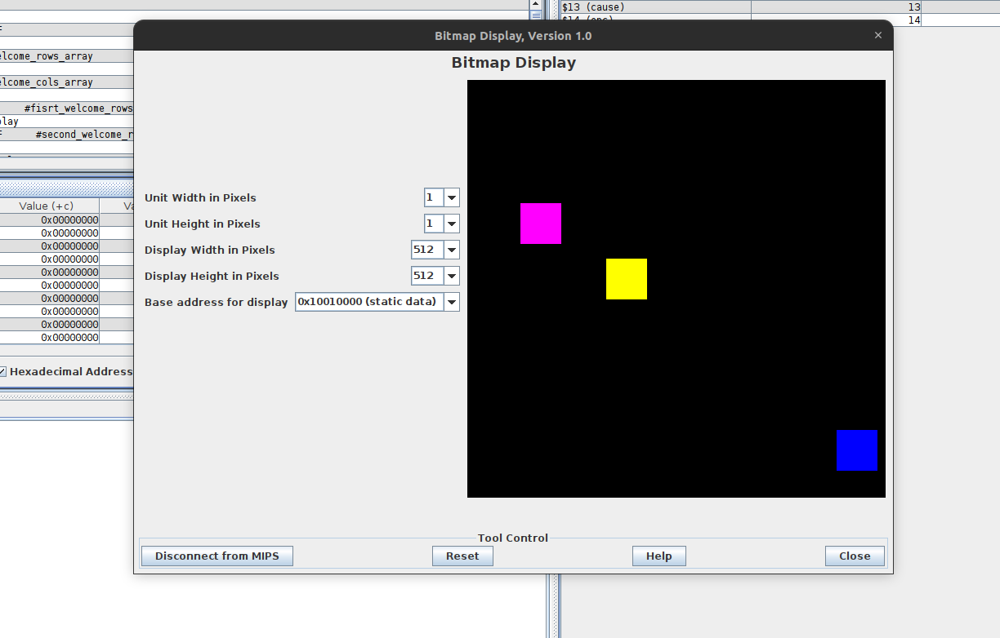
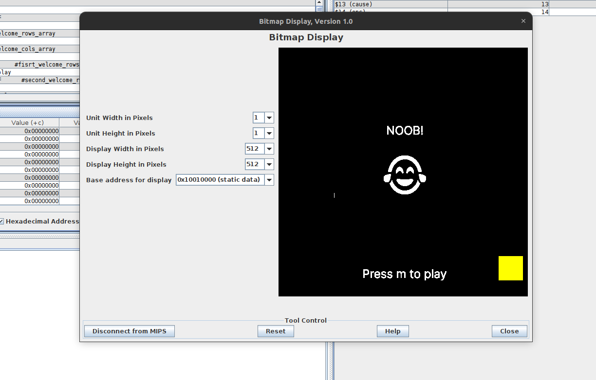

# Memory Game Assembly 

 Recall and count the number of squares of each color after they disappear. Be careful, the number of squares of each color will change after each round. Can you beat the high score?

# How to play

1. Once open the game, you will see the main menu. Press m key to start the game.
2. The game will show you a sequence of squares of different colors. Remember the number of squares of each color.
3. After the sequence disappears, you will be asked to enter the number of squares of each color.
4. If you enter the correct number of squares of each color, you will get 1 point. Otherwise you´re out.
5. An game over screen will appear when you lose and show messages depending on your score.
6. Press m key to restart the game.

# Requirements
* MARS (MIPS Assembler and Runtime Simulator)
* Java 8

# How to run the game

1. Install Java if you don´t have it installed.
2. Download and install MARS from [here](https://courses.missouristate.edu/kenvollmar/mars/download.htm).
3. Clone this repository.
4. Open MARS and open the file `main.asm` from the cloned repository.
5. Go to "Tools" 

6. Select "Bitmap Display"

7. Set the following configuration:

8. Press "Connect to MIPS"

9. Compile and run the game.

# Code structure

The code is in a single file called `main.asm`. The code is divided in 2 sections: data, text

## Data

In this section we define the variables and constants that we will use in the game. 

### Variables
* Bitmap display arrays: Used to render text into screen, represents row by row the pixels of the screen. Each array represents a color. The arrays are defined as follows:

name | size | value | description

:---:|:---:|:---:|:---:

* score
* target counter

....

## Text

Divided into main, functions and interrupts.

### Main
Is the main function of the game. It is divided into 3 parts: initialization (menu), game loop and game over.

#### Initialization (menu)
Render welcome message and wait for user input to start the game.

#### Game loop
Render the sequence of squares, wait for user input and check if the user input is correct.

#### Game over
Render game over message and wait for user input to restart the game.

## Known bugs

* The game will finish if you enter a number greater than 9.
* The game will finish if you enter a number less than 0.
* The game will finish if you don´t enter an m key to restart the game.

## Screenshots

## Credits and acknowledgments

* [MARS](https://courses.missouristate.edu/kenvollmar/mars/)
* [MIPS Assembly Language Programming](https://www.amazon.com/MIPS-Assembly-Language-Programming/dp/0131420445)
* [MIPS Assembly Language Programming Using QtSpim](https://www.amazon.com/MIPS-Assembly-Language-Programming-QtSpim/dp/0984209120)
* [MIPS Assembly Language Programming](https://www.youtube.com/watch?v=1aTnVzPdXCs&list=PL5b07qlmA3P6zUdDf-o97ddfpvPFuNa5A)

## Author
Aaron Santana Valdelomar [savaldev] (https://savaldev.com)
UCR - ECCI - Computer Architecture
2023

## License
[MIT](https://choosealicense.com/licenses/mit/)

